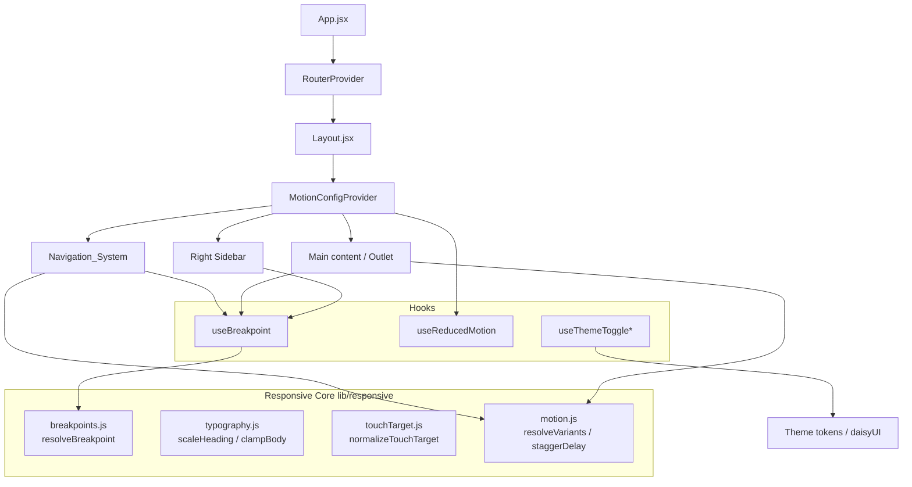

# Design Document

## Overview

This design describes how the Movie Explorer frontend becomes fully responsive across mobile, tablet, and desktop while improving navigation, readability, touch interaction, accessibility, motion, and theme consistency. The approach is grounded in the existing architecture: a React 19 + Vite single-page app, styled with Tailwind CSS, daisyUI (themes `light`, `dark`, `dracula`), and Radix UI / shadcn components, with `framer-motion` already installed.

The current layout (`src/layout/Layout.jsx`) renders three regions inside a rounded card shell:

- A left navigation region driven by `src/components/ui/Sidebar.jsx` (`DesktopSidebar` is hover-expandable and `hidden md:flex`; `MobileSidebar` is `md:hidden` and opens a full-screen overlay).
- A central scrollable `<main>` with a sticky header (`Movie Hub` title + `NotificationBell`).
- A right `<aside>` that is already `hidden md:block`.

The redesign keeps this structure but addresses concrete gaps found in the codebase:

1. **No formal breakpoint system.** Breakpoints are expressed ad hoc through Tailwind's default `sm`/`md` utilities. The requirements define explicit boundaries (mobile `<768px`, tablet `768–1023px`, desktop `>=1024px`) that do not align cleanly with Tailwind defaults (`md` = 768, `lg` = 1024). We introduce a canonical breakpoint definition shared by CSS and JS.
2. **Theme inconsistency.** The header in `Layout.jsx` hardcodes `bg-slate-950/80` and `text-white`, and `MovieCard.jsx` hardcodes slate/blue palettes instead of using the `--background`/`--foreground`/`--card` design tokens. This breaks theme consistency (Requirement 8). `useThemeToggle` also only switches `light`/`dark` and ignores `dracula`.
3. **No reduced-motion support.** `framer-motion` animations (e.g. `MovieCard`, `MobileSidebar`) use fixed durations and have no `prefers-reduced-motion` handling (Requirements 6.7, 7).
4. **No central motion system.** Animation values are scattered as inline literals; `src/lib/animations.js` only contains shake variants.
5. **Touch targets are not guaranteed.** Several controls (sidebar toggle icon, badges, theme checkbox) are smaller than 44×44 CSS pixels (Requirement 3).

The design introduces a small set of **pure helper modules** (`src/lib/responsive`) that encapsulate the testable logic — breakpoint resolution, typography scaling, touch-target normalization, and motion configuration — plus React hooks and a motion provider that consume them. Concentrating the decision logic in pure functions keeps the UI declarative and makes the behavior verifiable with property-based tests, while the visual/layout concerns are validated with example and integration tests.

## Architecture

### High-level structure



`*` `useThemeToggle` is extended to support all three themes.

### Layered responsibilities

- **Responsive core (`src/lib/responsive/*`)** — Pure, framework-free functions. No DOM, no React. These are the unit/property test surface.
- **Hooks (`src/hooks/*`)** — Thin adapters that subscribe to browser state (`matchMedia`, resize) and delegate decisions to the responsive core.
- **Layout & components** — Consume hooks and the motion system; remain declarative.
- **Theming** — daisyUI `data-theme` + Tailwind CSS variables; components reference design tokens (`bg-background`, `text-foreground`, `bg-card`) instead of literal palettes.

### Breakpoint strategy

We define a single source of truth used by both Tailwind config and the JS resolver to avoid the 768/1024 mismatch:

| Name      | Range (CSS px)     | Tailwind screen | Layout columns          | Right sidebar | Navigation        |
| --------- | ------------------ | --------------- | ----------------------- | ------------- | ----------------- |
| `mobile`  | `< 768`            | (base)          | 1 (stacked)             | hidden        | collapsed overlay |
| `tablet`  | `768 – 1023`       | `md`            | up to 2                 | hidden        | collapsed overlay |
| `desktop` | `>= 1024`          | `lg`            | multi-column + right    | visible       | left sidebar      |

Right-sidebar visibility moves from `hidden md:block` to `hidden lg:block` so the right sidebar appears only at desktop (Requirement 1.3, 2.5). The mobile navigation overlay applies through `lg:hidden` (currently `md:hidden`) so tablet also uses the collapsed menu, matching Requirement 2.1 which treats both mobile and tablet sub-desktop navigation, while desktop (`>=1024`) shows the expandable left sidebar (Requirement 2.4).

### Motion system

A `MotionConfigProvider` wraps the app inside `Layout`. It reads the reduced-motion preference once and provides:

- framer-motion's `MotionConfig` with `reducedMotion="user"` so framer-motion automatically zeroes transform/opacity transitions when the OS setting is on.
- A `useAppMotion()` hook exposing `resolveVariants(variant)` and `staggerDelay(index)` from the responsive core, so components request named variants rather than hardcoding values.

Named variants (page enter, item enter, modal enter/exit, card hover) are defined once in `src/lib/responsive/motion.js` with durations bounded by the requirements (page/modal <=600ms, hover <=300ms, stagger 50–150ms). When reduced motion is active, `resolveVariants` returns the final visual state with `duration: 0` and no positional offset; essential feedback animations (loaders) are flagged and retained with non-positional motion only.

## Components and Interfaces

### Responsive core (pure modules)

`src/lib/responsive/breakpoints.js`

```js
export const BREAKPOINTS = { mobile: 0, tablet: 768, desktop: 1024 };

/** Map a viewport width (CSS px) to a breakpoint name. */
export function resolveBreakpoint(width) // => 'mobile' | 'tablet' | 'desktop'

/** Media query strings derived from BREAKPOINTS, for matchMedia. */
export function breakpointQuery(name) // => string
```

`src/lib/responsive/typography.js`

```js
export const BODY_MIN = 16;       // px, all breakpoints
export const BODY_MAX = 20;       // px, tablet/desktop
export const HEADING_MIN_RATIO = 1.25;
export const HEADING_MAX_RATIO = 2.5;

/** Clamp a desired body size into the legal band for a breakpoint. */
export function clampBodySize(px, breakpoint) // => number in [16, ∞) on mobile, [16,20] otherwise

/** Compute a heading size within [1.25x, 2.5x] of the body size. */
export function scaleHeading(bodyPx, ratio) // => number
```

`src/lib/responsive/touchTarget.js`

```js
export const MIN_TOUCH_PX = 44;
export const MIN_GAP_PX = 8;

/** Return padding/min-size needed so an element's activatable area is >= 44x44
 *  without changing its visible content box. */
export function normalizeTouchTarget({ width, height }) // => { minWidth, minHeight, padX, padY }
```

`src/lib/responsive/motion.js`

```js
export const MOTION = { pageMs: 400, modalMs: 300, hoverMs: 200, staggerMinMs: 50, staggerMaxMs: 150 };

/** Per-item entrance delay; clamped to [50,150] ms and returned in seconds. */
export function staggerDelay(index, perItemMs = 60) // => seconds

/** Resolve a named variant honoring reduced motion. */
export function resolveVariants(name, { reducedMotion, essential = false }) // => framer-motion variants
```

### Hooks

`src/hooks/useBreakpoint.js`

```js
/** Subscribes to matchMedia; returns the current breakpoint name and booleans. */
export function useBreakpoint() // => { breakpoint, isMobile, isTablet, isDesktop }
```

- Uses `window.matchMedia(breakpointQuery(...))` with change listeners; updates synchronously on change (Requirement 1.4: well under 500ms). SSR-safe default of `desktop` when `window` is undefined.

`src/hooks/useReducedMotion.js`

```js
/** Returns boolean tracking prefers-reduced-motion: reduce, live-updating. */
export function useReducedMotion() // => boolean
```

`src/hooks/useThemeToggle.js` (extended)

```js
export function useTheme() // => { theme, setTheme, themes: ['light','dark','dracula'] }
```

- Replaces the boolean-only toggle. Persists to `localStorage('theme')`, sets `data-theme` and the `.dark` class (so Tailwind `dark:` variants keep working for `dark` and `dracula`). On apply failure, retains previous theme and surfaces a `sonner` toast (Requirement 8.4).

### Layout and navigation changes

- `Layout.jsx`
  - Wrap content tree in `MotionConfigProvider`.
  - Header: replace `bg-slate-950/80 text-white` with token classes (`bg-card/80 text-foreground border-border`) so it follows the active theme (Requirement 8.1).
  - Right `<aside>`: `hidden md:block` → `hidden lg:block` (Requirement 2.5, 1.3).
  - Header remains `sticky top-0 z-50` (Requirement 2.6).
- `Sidebar.jsx`
  - `MobileSidebar`/`DesktopSidebar` breakpoint switch from `md` to `lg`.
  - Toggle control (`Menu`/`X`) wrapped to a >=44×44 hit area via `normalizeTouchTarget` utility classes (Requirement 2.7, 3.1).
  - Overlay open/close uses `resolveVariants('mobileNav', ...)`; reduced motion renders final state instantly (Requirement 2.9).
  - Add `aria-label`, `aria-expanded`, and `aria-controls` to the toggle; overlay is a labeled landmark; links remain keyboard operable (Requirement 5.1, 5.3).
- `MovieCard.jsx`
  - Replace hardcoded slate/blue palette with tokens where it affects theme fidelity; keep accent gradients as decorative.
  - Hover/entrance animation goes through the motion system (Requirement 6.2, 6.5, 6.7).
  - Poster `` keeps `object-cover` and aspect ratio; ensure `alt` is always present (Requirement 4.4, 5.4).
- `dialog.jsx`
  - Open/close already animated via tailwindcss-animate; ensure durations <=600ms and that reduced-motion users get instant show/hide via a `motion-reduce:` utility or the motion system (Requirement 6.3, 6.4, 6.7).

### Responsive grid utility

A reusable `MovieGrid` wrapper applies column counts per breakpoint (`grid-cols-1` / `sm:grid-cols-2` / `lg:grid-cols-3+`) and uses `staggerDelay` for item entrance, replacing ad hoc grids across Home/Discovery/Watchlist.

## Data Models

These are lightweight value objects (plain JS), not persisted entities.

```ts
type BreakpointName = 'mobile' | 'tablet' | 'desktop';

interface BreakpointState {
  breakpoint: BreakpointName;
  isMobile: boolean;
  isTablet: boolean;
  isDesktop: boolean;
}

type ThemeName = 'light' | 'dark' | 'dracula';

interface ThemeState {
  theme: ThemeName;        // active theme
  previous: ThemeName;     // last successfully applied theme (for rollback)
}

interface TouchTargetBox {
  minWidth: number;        // >= 44
  minHeight: number;       // >= 44
  padX: number;            // >= 0
  padY: number;            // >= 0
}

interface MotionVariant {
  initial: Record<string, number>;
  animate: Record<string, number>;
  exit?: Record<string, number>;
  transition: { duration: number; delay?: number; ease?: string };
}

interface MotionContextValue {
  reducedMotion: boolean;
  resolveVariants: (name: string, opts?: { essential?: boolean }) => MotionVariant;
  staggerDelay: (index: number) => number; // seconds
}
```

Persistence: only the active theme is persisted (`localStorage['theme']`). Breakpoint and motion states are derived at runtime from `matchMedia`.

## Correctness Properties

*A property is a characteristic or behavior that should hold true across all valid executions of a system — essentially, a formal statement about what the system should do. Properties serve as the bridge between human-readable specifications and machine-verifiable correctness guarantees.*

The properties below apply to the **responsive core** of this feature — the pure functions that decide breakpoints, typography sizes, touch-target dimensions, motion configuration, and theme state transitions. These functions have large input spaces (any viewport width, any element size, any body size, any theme transition) and clear input/output behavior, so universal properties are meaningful. The visual, layout, contrast, and accessibility concerns are validated separately with example, integration, and accessibility-audit tests (see Testing Strategy), because they are not input-varying pure logic.

### Property 1: Breakpoint resolution partitions viewport widths

*For any* non-negative viewport width, `resolveBreakpoint(width)` returns exactly one breakpoint such that widths below 768 map to `mobile`, widths from 768 through 1023 map to `tablet`, and widths of 1024 or greater map to `desktop`.

**Validates: Requirements 1.1, 1.2, 1.3**

### Property 2: Layout, navigation, and right-sidebar selection follow the breakpoint

*For any* viewport width, the derived layout selection holds simultaneously: the column count is 1 at `mobile`, at most 2 at `tablet`, and the multi-column desktop layout (which includes the right sidebar) only at `desktop`; the navigation mode is the collapsed overlay for every sub-desktop width and the expandable left sidebar at `desktop`; and the right sidebar is visible only at `desktop`.

**Validates: Requirements 1.1, 1.2, 1.3, 2.1, 2.4, 2.5**

### Property 3: Touch targets meet the minimum activatable area without shrinking content

*For any* element content size `{width, height}`, `normalizeTouchTarget` returns `minWidth >= 44` and `minHeight >= 44`, and when a dimension is below 44 the added padding compensates symmetrically so the visible content box is never reduced.

**Validates: Requirements 2.7, 3.1, 3.4**

### Property 4: Body text size stays within the legal band per breakpoint

*For any* desired body size and breakpoint, `clampBodySize` returns at least 16 pixels at `mobile`, and between 16 and 20 pixels inclusive at `tablet` and `desktop`.

**Validates: Requirements 4.1, 4.2**

### Property 5: Heading size scales within the allowed ratio of body size

*For any* body size and any ratio, `scaleHeading` returns a value that is at least 1.25 times and no more than 2.5 times the body size for that breakpoint.

**Validates: Requirements 4.3**

### Property 6: Media display preserves source aspect ratio

*For any* source image dimensions and any container width, the computed display height fills the container width and preserves the source aspect ratio within a tolerance of plus or minus 1 percent.

**Validates: Requirements 4.4**

### Property 7: List entrance stagger delay stays within bounds

*For any* item index, `staggerDelay(index)` returns a per-item start delay between 50 and 150 milliseconds inclusive.

**Validates: Requirements 6.2**

### Property 8: Animation durations stay within their budgets and terminate in the correct visual state

*For any* named motion variant, `resolveVariants(name)` produces a transition duration no greater than 600 milliseconds (no greater than 300 milliseconds for hover/card variants); page-enter and modal-enter variants terminate at 100% opacity, and the modal-exit variant terminates at 0% opacity.

**Validates: Requirements 6.1, 6.3, 6.4, 6.5, 6.6**

### Property 9: Card hover transition returns to its resting state

*For any* card hover variant, the visual state after the hover or focus ends is equal to the resting (initial) state, so hovering and then un-hovering is a round trip with no residual change.

**Validates: Requirements 6.5**

### Property 10: Reduced motion yields the final state with no transition or displacement

*For any* non-essential named variant resolved with `reducedMotion = true`, the effective transition duration is 0 and the animated state equals the final visual state with no positional (x/y) displacement and no intermediate opacity transition.

**Validates: Requirements 2.9, 6.7, 7.1**

### Property 11: Essential animations under reduced motion limit positional displacement

*For any* essential named variant resolved with `reducedMotion = true`, the animation is retained but its positional displacement never exceeds 5 pixels on any axis.

**Validates: Requirements 7.3**

### Property 12: Theme token resolution is independent of breakpoint

*For any* theme and any two breakpoints, the resolved set of theme token values is identical, so a theme renders the same regardless of viewport size.

**Validates: Requirements 8.1**

### Property 13: Breakpoint changes preserve the active theme

*For any* active theme and any sequence of breakpoint changes, the active theme after the changes equals the active theme before them, with no revert and no reload required.

**Validates: Requirements 8.3**

### Property 14: Failed theme application rolls back to the previous theme

*For any* previous theme and any attempted theme, if applying the attempted theme fails, the resulting active theme equals the previous theme and an error indicator is set.

**Validates: Requirements 8.4**

## Error Handling

- **Missing `window`/`matchMedia` (SSR, tests, older runtimes).** `useBreakpoint` and `useReducedMotion` guard on `typeof window` and the presence of `matchMedia`, defaulting to `desktop` and `reducedMotion = false`. The pure resolvers never touch the DOM, so they remain testable in isolation.
- **Invalid or out-of-range inputs to the responsive core.** `resolveBreakpoint` treats negative or `NaN` widths as `mobile` (smallest layout) rather than throwing. `clampBodySize`/`scaleHeading` clamp rather than reject, guaranteeing a renderable value. `normalizeTouchTarget` floors negative sizes to 0 before normalizing.
- **Theme application failure (Requirement 8.4).** The theme reducer attempts to set `data-theme` and persist to `localStorage`. If the DOM update throws or `localStorage` is unavailable (private mode, quota), the reducer keeps `previous` as the active theme, leaves the DOM on the prior theme, and dispatches a visible `sonner` error toast. No partial theme state is committed.
- **Persisted theme corruption.** On load, if `localStorage['theme']` is not one of `light`/`dark`/`dracula`, the app falls back to the OS color-scheme preference (existing behavior) and rewrites a valid value.
- **Animation/runtime resilience.** Motion is purely presentational; if `framer-motion` variant resolution receives an unknown name, `resolveVariants` returns a no-op variant (final state, duration 0) so rendering never breaks.
- **Reduced-motion live changes (Requirement 7.4).** The motion provider subscribes to the media query and updates context; in-flight animations are superseded by the final-state variant.

## Testing Strategy

### Tooling

The frontend currently has no test runner. This design adds **Vitest** (native Vite integration), **@testing-library/react** + **jsdom** for component/interaction tests, **fast-check** for property-based tests, and **jest-axe** for accessibility audits. These are dev-only dependencies and do not affect the production bundle.

### Dual approach

- **Property-based tests** verify the universal properties above against the pure responsive core (`src/lib/responsive/*`) and the theme reducer. Each correctness property maps to exactly one property-based test.
- **Unit / example tests** verify concrete interactions and specific scenarios.
- **Integration tests** verify layout, accessibility, and theme wiring against rendered DOM.

### Property-based test rules

- Use **fast-check** (do not hand-roll generators or PBT infrastructure).
- Each property test runs a **minimum of 100 iterations** (`{ numRuns: 100 }`).
- Each property test is tagged with a comment referencing its design property in the format:
  `// Feature: responsive-ui-redesign, Property {number}: {property_text}`
- Generators: widths via `fc.nat({ max: 4000 })` (with boundary seeding at 767/768/1023/1024); element sizes via `fc.record({ width: fc.nat(), height: fc.nat() })`; body sizes via `fc.integer({ min: 8, max: 40 })`; themes via `fc.constantFrom('light','dark','dracula')`; indices via `fc.nat({ max: 200 })`; variant names via `fc.constantFrom(...variantNames)`.

Property-to-test mapping:

| Property | Module under test | Generators |
| -------- | ----------------- | ---------- |
| 1, 2 | `breakpoints.js`, layout mapping | widths (boundary-seeded) |
| 3 | `touchTarget.js` | element sizes |
| 4 | `typography.js` `clampBodySize` | body size × breakpoint |
| 5 | `typography.js` `scaleHeading` | body size × ratio |
| 6 | media aspect-ratio helper | source dims × container width |
| 7 | `motion.js` `staggerDelay` | index |
| 8, 9, 10, 11 | `motion.js` `resolveVariants` | variant name × reducedMotion flag |
| 12, 13, 14 | theme reducer / token resolver | theme × breakpoint sequence |

### Example / unit tests

- Nav toggle opens and closes the mobile overlay (2.2, 2.8); selecting a link navigates (2.3).
- Header is `sticky` and remains in view after scrolling (2.6).
- Mobile lists apply gap >= 8px (3.2); interactive elements define an active/hover feedback state (3.3).
- Long text in a fixed-width container applies `line-clamp-3` with ellipsis (4.5).
- Poster images render with non-empty `alt` (5.4).
- Theme change updates `document.documentElement[data-theme]` and re-renders tokens (8.2).

### Integration / accessibility tests

- Render each Primary_Page at representative widths (375, 768, 1024, 1440) and assert no horizontal overflow (`scrollWidth <= clientWidth`) and no clipping (1.4, 1.5, 1.6, 1.7).
- Simulate `matchMedia` change events and assert `useBreakpoint` updates state (1.4).
- `jest-axe` audits for accessible names, focus order, and no focus traps (5.1, 5.2, 5.3, 5.7).
- Per-theme contrast checks using a contrast utility over the design tokens for normal and large text (5.5, 5.6).
- Reduced-motion: with `prefers-reduced-motion: reduce`, controls are immediately present and operable (7.2); toggling the preference mid-animation snaps to final state (7.4).

### Why property-based testing is scoped to the core

The layout rendering, CSS reflow, contrast, and keyboard behavior are not pure input-varying functions — running them 100 times with random inputs adds no coverage beyond representative examples, and they depend on the browser/DOM. They are therefore validated with example, integration, visual, and accessibility tests rather than PBT, per the testing guidance. Concentrating the variable decision logic in `src/lib/responsive/*` is a deliberate design choice that makes the highest-risk behavior (breakpoint math, sizing, motion bounds, theme transitions) cheaply and exhaustively testable.
