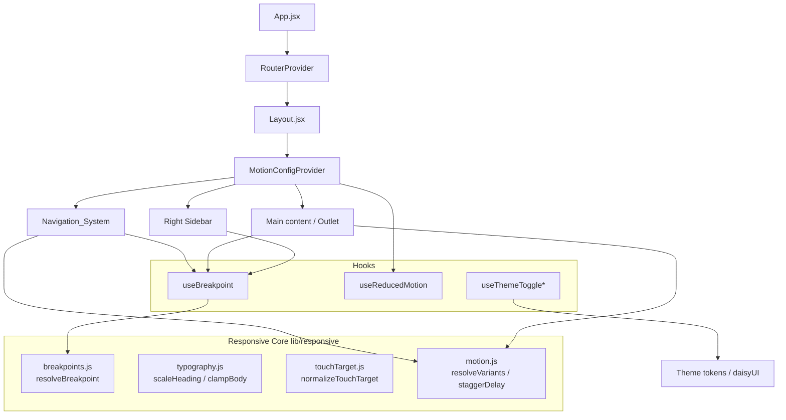
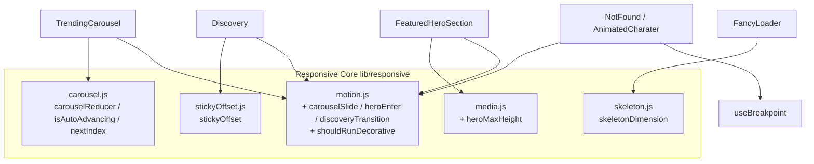

# Design Document

## Overview

This design describes how the Movie Explorer frontend becomes fully responsive across mobile, tablet, and desktop while improving navigation, readability, touch interaction, accessibility, motion, and theme consistency. The approach is grounded in the existing architecture: a React 19 + Vite single-page app, styled with Tailwind CSS, daisyUI (themes `light`, `dark`, `dracula`), and Radix UI / shadcn components, with `framer-motion` already installed.

The current layout (`src/layout/Layout.jsx`) renders three regions inside a rounded card shell:

- A left navigation region driven by `src/components/ui/Sidebar.jsx` (`DesktopSidebar` is hover-expandable and `hidden md:flex`; `MobileSidebar` is `md:hidden` and opens a full-screen overlay).
- A central scrollable `<main>` with a sticky header (`Movie Hub` title + `NotificationBell`).
- A right `<aside>` that is already `hidden md:block`.

The redesign keeps this structure but addresses concrete gaps found in the codebase:

1. **No formal breakpoint system.** Breakpoints are expressed ad hoc through Tailwind's default `sm`/`md` utilities. The requirements define explicit boundaries (mobile `<768px`, tablet `768–1023px`, desktop `>=1024px`) that do not align cleanly with Tailwind defaults (`md` = 768, `lg` = 1024). We introduce a canonical breakpoint definition shared by CSS and JS.
2. **Theme inconsistency.** The header in `Layout.jsx` hardcodes `bg-slate-950/80` and `text-white`, and `MovieCard.jsx` hardcodes slate/blue palettes instead of using the `--background`/`--foreground`/`--card` design tokens. This breaks theme consistency (Requirement 8). `useThemeToggle` also only switches `light`/`dark` and ignores `dracula`.
3. **No reduced-motion support.** `framer-motion` animations (e.g. `MovieCard`, `MobileSidebar`) use fixed durations and have no `prefers-reduced-motion` handling (Requirements 6.7, 7).
4. **No central motion system.** Animation values are scattered as inline literals; `src/lib/animations.js` only contains shake variants.
5. **Touch targets are not guaranteed.** Several controls (sidebar toggle icon, badges, theme checkbox) are smaller than 44×44 CSS pixels (Requirement 3).

The design introduces a small set of **pure helper modules** (`src/lib/responsive`) that encapsulate the testable logic — breakpoint resolution, typography scaling, touch-target normalization, and motion configuration — plus React hooks and a motion provider that consume them. Concentrating the decision logic in pure functions keeps the UI declarative and makes the behavior verifiable with property-based tests, while the visual/layout concerns are validated with example and integration tests.

### Second wave: motion-system compliance for hardcoded-motion components (Requirements 9–20)

The first wave above established the responsive and motion *foundation*: the responsive core (`src/lib/responsive/{breakpoints,typography,touchTarget,media,motion,theme}.js`), the hooks (`useBreakpoint`, `useReducedMotion`, extended `useTheme`/`useThemeToggle`), and the `MotionConfigProvider` that exposes `useAppMotion()` with `resolveVariants()` / `staggerDelay()`.

The second wave **migrates the remaining heavily-animated components onto that existing foundation rather than building a parallel system**. Inspection of the codebase found several components that bypass the motion system with inline `framer-motion` literals, looping `repeat: Infinity` animations, `Math.random()` layout values, hardcoded color literals, and dead transitions:

1. **`TrendingCarousel`** — inline `slideVariants`, a hardcoded `setInterval(…, 8000)` auto-advance with no pause/stop affordance and no reduced-motion gate, absolute-positioned slides inside a fixed `min-h-[400px]`, nav arrows pinned `bottom-8 right-8` over content, and `bg-white/5 dark:bg-slate-800/50` / `text-gray-900 dark:text-white` literals.
2. **`FeaturedHeroSection`** — `h-[85vh]` height, **two** competing scale sources on the image (an entrance `animate={{ scale: 1 }}` from `1.1` over 10s *and* a scroll-driven `useTransform` scale `1 → 1.1`), plus scroll parallax with no reduced-motion handling.
3. **`NotFound` + `AnimatedCharater`** — perpetual `repeat: Infinity` sparkles/float/color-cycle loops, pointer-parallax updated on every `mousemove` with no throttle, `AnimatedCharater` hidden CSS-only via `hidden md:flex` (so its loops keep running offscreen), and pink/purple/`#1f2937` literals.
4. **`EpisodeModal`** — inline `initial/animate` entrance literals and `from-white to-slate-50 dark:from-slate-900` token-bypassing colors.
5. **`Discovery`** — a **dead `AnimatePresence`** (a single child with no `key`, so it never animates type/sort changes), a magic `sticky top-28` offset, and slate/blue/gray literals.
6. **`FancyLoader`** — `Math.random()` skeleton widths (layout shift on every render) and **three** different shimmer techniques mixed together (`before:animate-[shimmer]`, `animate-pulse`, and a framer `x: ['-100%','100%']` loop), with slate/indigo literals.
7. **`DesktopSidebar`** — expands on `onMouseEnter`/`onMouseLeave` only (no keyboard focus path).
8. **`Toaster`** — `theme={isDark ? 'dark' : 'light'}`, which collapses `dracula` onto the wrong palette.
9. **`MovieCard`** — already consumes `useAppMotion()` for `itemEnter`/`cardHover`, but layers competing inner `whileHover={{ scale: 1.08 }}` / badge / genre hovers on top, and uses a non-standard `h-30` poster class.

To keep the migration verifiable, the second wave adds a few more **pure helper modules** (`carousel.js`, `stickyOffset.js`, `skeleton.js`, plus small additions to `motion.js` and `media.js`) and **new named variants** (`carouselSlide`, `heroEnter`, `discoveryTransition`) to the existing `VARIANTS` table — reusing the existing `modalEnter`/`modalExit`/`itemEnter`/`cardHover` variants where they already fit. A key constraint drives the design: framer-motion's `MotionConfig reducedMotion="user"` zeroes transform/opacity *transitions*, but it does **not** stop `repeat: Infinity` loops. Components must therefore *also* gate looping/perpetual and parallax animations on the live `reducedMotion` flag (and, for offscreen decoration, on a breakpoint hook) via a pure `shouldRunDecorative()` predicate.

## Architecture

### High-level structure



`*` `useThemeToggle` is extended to support all three themes.

### Layered responsibilities

- **Responsive core (`src/lib/responsive/*`)** — Pure, framework-free functions. No DOM, no React. These are the unit/property test surface.
- **Hooks (`src/hooks/*`)** — Thin adapters that subscribe to browser state (`matchMedia`, resize) and delegate decisions to the responsive core.
- **Layout & components** — Consume hooks and the motion system; remain declarative.
- **Theming** — daisyUI `data-theme` + Tailwind CSS variables; components reference design tokens (`bg-background`, `text-foreground`, `bg-card`) instead of literal palettes.

### Breakpoint strategy

We define a single source of truth used by both Tailwind config and the JS resolver to avoid the 768/1024 mismatch:

| Name      | Range (CSS px)     | Tailwind screen | Layout columns          | Right sidebar | Navigation        |
| --------- | ------------------ | --------------- | ----------------------- | ------------- | ----------------- |
| `mobile`  | `< 768`            | (base)          | 1 (stacked)             | hidden        | collapsed overlay |
| `tablet`  | `768 – 1023`       | `md`            | up to 2                 | hidden        | collapsed overlay |
| `desktop` | `>= 1024`          | `lg`            | multi-column + right    | visible       | left sidebar      |

Right-sidebar visibility moves from `hidden md:block` to `hidden lg:block` so the right sidebar appears only at desktop (Requirement 1.3, 2.5). The mobile navigation overlay applies through `lg:hidden` (currently `md:hidden`) so tablet also uses the collapsed menu, matching Requirement 2.1 which treats both mobile and tablet sub-desktop navigation, while desktop (`>=1024`) shows the expandable left sidebar (Requirement 2.4).

### Motion system

A `MotionConfigProvider` wraps the app inside `Layout`. It reads the reduced-motion preference once and provides:

- framer-motion's `MotionConfig` with `reducedMotion="user"` so framer-motion automatically zeroes transform/opacity transitions when the OS setting is on.
- A `useAppMotion()` hook exposing `resolveVariants(variant)` and `staggerDelay(index)` from the responsive core, so components request named variants rather than hardcoding values.

Named variants (page enter, item enter, modal enter/exit, card hover) are defined once in `src/lib/responsive/motion.js` with durations bounded by the requirements (page/modal <=600ms, hover <=300ms, stagger 50–150ms). When reduced motion is active, `resolveVariants` returns the final visual state with `duration: 0` and no positional offset; essential feedback animations (loaders) are flagged and retained with non-positional motion only.

### Motion-system extensions for hardcoded-motion components (Requirements 9–20)

The second wave extends the *existing* motion system instead of duplicating it.

**New named variants** (added to the existing `VARIANTS` table in `motion.js`, so they are automatically covered by the existing `resolveVariants` duration-budget and reduced-motion logic, and by Properties 8/10/11):

| Variant | Purpose | Notes |
| ------- | ------- | ----- |
| `carouselSlide` | `TrendingCarousel` slide enter/center/exit | Replaces the inline `slideVariants`. Bounded opacity + small x offset within the <=600ms budget; reduced motion snaps to the centered, displacement-free state. |
| `heroEnter` | `FeaturedHeroSection` image/content entrance | Single source of scale; reduced motion renders final scale with no zoom. |
| `discoveryTransition` | `Discovery` type/sort change transition | Opacity + small y; reduced motion renders final state. |
| `modalEnter` / `modalExit` | `EpisodeModal` open/close | **Reused as-is** — already defined in the first wave; `EpisodeModal` is reconciled onto them rather than adding new modal variants. |
| `itemEnter` / `cardHover` | `MovieCard` entrance/hover | **Reused as-is**; `MovieCard` already consumes them. The migration removes the competing inner hover transforms so `cardHover` is the single coherent driver. |

**The looping-animation gap.** `MotionConfig reducedMotion="user"` zeroes transform/opacity *transitions*, but a `repeat: Infinity` loop (sparkles, floats, color-cycles, the loader spinner) keeps iterating. The motion core therefore adds a pure predicate consumed by components:

```js
// motion.js
shouldRunDecorative({ reducedMotion, visible }) // => visible && !reducedMotion
```

Components gate every perpetual/decorative loop *and* the `NotFound` pointer-parallax on `shouldRunDecorative(...)`, using the live `useAppMotion().reducedMotion` flag and (for offscreen decoration like `AnimatedCharater`) the `useBreakpoint()` visibility instead of CSS-only `hidden`. This satisfies Requirements 9.3, 16.1, 16.2, and 16.4, which `reducedMotion="user"` alone cannot.

**New pure helper modules** (the property-test surface for the second wave):



These modules contain no DOM/React/timer code: the carousel module is a state reducer plus a derived `isAutoAdvancing` predicate (the React component owns the actual `setInterval`/`clearInterval` and event wiring); `stickyOffset` and `heroMaxHeight` are arithmetic; `skeletonDimension` is a deterministic hash of an index. This keeps the highest-risk new logic cheaply property-testable while leaving layout, timers, and DOM wiring to example/integration tests.

## Components and Interfaces

### Responsive core (pure modules)

`src/lib/responsive/breakpoints.js`

```js
export const BREAKPOINTS = { mobile: 0, tablet: 768, desktop: 1024 };

/** Map a viewport width (CSS px) to a breakpoint name. */
export function resolveBreakpoint(width) // => 'mobile' | 'tablet' | 'desktop'

/** Media query strings derived from BREAKPOINTS, for matchMedia. */
export function breakpointQuery(name) // => string
```

`src/lib/responsive/typography.js`

```js
export const BODY_MIN = 16;       // px, all breakpoints
export const BODY_MAX = 20;       // px, tablet/desktop
export const HEADING_MIN_RATIO = 1.25;
export const HEADING_MAX_RATIO = 2.5;

/** Clamp a desired body size into the legal band for a breakpoint. */
export function clampBodySize(px, breakpoint) // => number in [16, ∞) on mobile, [16,20] otherwise

/** Compute a heading size within [1.25x, 2.5x] of the body size. */
export function scaleHeading(bodyPx, ratio) // => number
```

`src/lib/responsive/touchTarget.js`

```js
export const MIN_TOUCH_PX = 44;
export const MIN_GAP_PX = 8;

/** Return padding/min-size needed so an element's activatable area is >= 44x44
 *  without changing its visible content box. */
export function normalizeTouchTarget({ width, height }) // => { minWidth, minHeight, padX, padY }
```

`src/lib/responsive/motion.js`

```js
export const MOTION = { pageMs: 400, modalMs: 300, hoverMs: 200, staggerMinMs: 50, staggerMaxMs: 150 };

/** Per-item entrance delay; clamped to [50,150] ms and returned in seconds. */
export function staggerDelay(index, perItemMs = 60) // => seconds

/** Resolve a named variant honoring reduced motion. */
export function resolveVariants(name, { reducedMotion, essential = false }) // => framer-motion variants
```

### Hooks

`src/hooks/useBreakpoint.js`

```js
/** Subscribes to matchMedia; returns the current breakpoint name and booleans. */
export function useBreakpoint() // => { breakpoint, isMobile, isTablet, isDesktop }
```

- Uses `window.matchMedia(breakpointQuery(...))` with change listeners; updates synchronously on change (Requirement 1.4: well under 500ms). SSR-safe default of `desktop` when `window` is undefined.

`src/hooks/useReducedMotion.js`

```js
/** Returns boolean tracking prefers-reduced-motion: reduce, live-updating. */
export function useReducedMotion() // => boolean
```

`src/hooks/useThemeToggle.js` (extended)

```js
export function useTheme() // => { theme, setTheme, themes: ['light','dark','dracula'] }
```

- Replaces the boolean-only toggle. Persists to `localStorage('theme')`, sets `data-theme` and the `.dark` class (so Tailwind `dark:` variants keep working for `dark` and `dracula`). On apply failure, retains previous theme and surfaces a `sonner` toast (Requirement 8.4).

### Layout and navigation changes

- `Layout.jsx`
  - Wrap content tree in `MotionConfigProvider`.
  - Header: replace `bg-slate-950/80 text-white` with token classes (`bg-card/80 text-foreground border-border`) so it follows the active theme (Requirement 8.1).
  - Right `<aside>`: `hidden md:block` → `hidden lg:block` (Requirement 2.5, 1.3).
  - Header remains `sticky top-0 z-50` (Requirement 2.6).
- `Sidebar.jsx`
  - `MobileSidebar`/`DesktopSidebar` breakpoint switch from `md` to `lg`.
  - Toggle control (`Menu`/`X`) wrapped to a >=44×44 hit area via `normalizeTouchTarget` utility classes (Requirement 2.7, 3.1).
  - Overlay open/close uses `resolveVariants('mobileNav', ...)`; reduced motion renders final state instantly (Requirement 2.9).
  - Add `aria-label`, `aria-expanded`, and `aria-controls` to the toggle; overlay is a labeled landmark; links remain keyboard operable (Requirement 5.1, 5.3).
- `MovieCard.jsx`
  - Replace hardcoded slate/blue palette with tokens where it affects theme fidelity; keep accent gradients as decorative.
  - Hover/entrance animation goes through the motion system (Requirement 6.2, 6.5, 6.7).
  - Poster `` keeps `object-cover` and aspect ratio; ensure `alt` is always present (Requirement 4.4, 5.4).
- `dialog.jsx`
  - Open/close already animated via tailwindcss-animate; ensure durations <=600ms and that reduced-motion users get instant show/hide via a `motion-reduce:` utility or the motion system (Requirement 6.3, 6.4, 6.7).

### Responsive grid utility

A reusable `MovieGrid` wrapper applies column counts per breakpoint (`grid-cols-1` / `sm:grid-cols-2` / `lg:grid-cols-3+`) and uses `staggerDelay` for item entrance, replacing ad hoc grids across Home/Discovery/Watchlist.

### Motion-system migration: new pure modules (Requirements 9–20)

`src/lib/responsive/carousel.js` — auto-advance state machine (no timers, no DOM)

```js
export const AUTO_ADVANCE_MS = 8000; // Requirement 10.1

/** Initial state for an N-slide carousel. */
export function createCarouselState({ count, reducedMotion = false })
//   => { index, count, hovered, focused, userPaused, reducedMotion }

/** Pure reducer. Actions:
 *   NEXT | PREV | GOTO(index)
 *   HOVER_START | HOVER_END
 *   FOCUS_IN | FOCUS_OUT
 *   PAUSE (user pause/stop) | RESUME
 *   SET_REDUCED_MOTION(value) */
export function carouselReducer(state, action) // => next state (index always in [0, count))

/** Next/previous index with modular wrap-around. */
export function nextIndex(index, count, direction) // => (index + direction + count) % count

/** Derived predicate: is the timer allowed to auto-advance right now?
 *  True only when count > 1 AND none of hovered/focused/userPaused/reducedMotion hold. */
export function isAutoAdvancing(state) // => boolean
```

`src/lib/responsive/stickyOffset.js` — header-aware sticky offset (Requirement 14)

```js
export const HEADER_HEIGHT_VAR = '--header-height';

/** The vertical offset (px) at which the Discovery sort control pins:
 *  exactly the rendered header height, floored to >= 0. Non-finite -> 0.
 *  Equal offset => no gap and no overlap (14.1, 14.2). */
export function stickyOffset(headerHeightPx) // => number >= 0
```

The header bar publishes its measured height into the `--header-height` CSS variable (via a `ResizeObserver` in `Layout`); the sort control pins with `top: var(--header-height)` (replacing the magic `top-28`). `stickyOffset` is the pure arithmetic backing both the CSS-variable value and tests.

`src/lib/responsive/skeleton.js` — deterministic skeleton dimensions (Requirement 15)

```js
/** Deterministic placeholder size for slot `index`, replacing Math.random().
 *  Same (index, group, min, max) always yields the same value, so re-renders
 *  never shift layout (15.1, 15.2). Returns a value within [min, max]. */
export function skeletonDimension(index, { min, max, group = 0 }) // => number
```

Implemented as a small integer hash of `(index, group)` mapped into `[min, max]` — pure and stable across renders.

`src/lib/responsive/media.js` — hero height bound (Requirement 17), added beside existing `fitWidth`

```js
/** Maximum hero height (px) for a viewport: <= 70% of height in portrait,
 *  <= 80% in landscape (17.1, 17.2). */
export function heroMaxHeight(viewportHeightPx, { landscape = false }) // => number
```

`src/lib/responsive/motion.js` — additions

```js
// New named variants merged into VARIANTS: carouselSlide, heroEnter, discoveryTransition.

/** Should a decorative/looping/parallax animation run at all?
 *  Loops are NOT stopped by MotionConfig reducedMotion="user", so components
 *  gate them on this predicate (9.3, 16.1, 16.2, 16.4). */
export function shouldRunDecorative({ reducedMotion, visible }) // => visible && !reducedMotion
```

### Component migrations (Requirements 9–20)

- **`TrendingCarousel.jsx`** (R9, R10, R11, R12)
  - Replace inline `slideVariants` with `resolveVariants('carouselSlide')` from `useAppMotion()`; the perpetual `animate-pulse` background blobs are gated on `shouldRunDecorative({ reducedMotion, visible: true })` (R9.1–9.3).
  - Drive auto-advance from `carousel.js`: a `useReducer(carouselReducer, …)`; a single `useEffect` starts `setInterval(dispatch(NEXT), AUTO_ADVANCE_MS)` **only while `isAutoAdvancing(state)`**, and clears it otherwise. Pointer `onMouseEnter`/`onMouseLeave` dispatch `HOVER_START`/`HOVER_END`; `onFocus`/`onBlur` (focus-within) dispatch `FOCUS_IN`/`FOCUS_OUT`; reduced-motion changes dispatch `SET_REDUCED_MOTION` (R10.1–10.3, 10.6). The timer is cleared on every state change where `isAutoAdvancing` is false and re-created when it becomes true again, so resume is automatic for hover/focus and explicit for user pause.
  - Add a labelled pause/stop toggle (`Pause`/`Play` icon) sized via `normalizeTouchTarget`; it dispatches `PAUSE`/`RESUME` and halts until the user explicitly resumes (R10.4, R10.5).
  - **Content fit (R11):** replace the fixed `min-h-[400px]` + `absolute inset-0` slides with a non-absolute layout. Slides occupy normal flow (a single grid cell, `display: grid; grid-template-areas: 'slide'` with all slides stacked in the same cell so the container sizes to the tallest), so the container height grows to the tallest slide's content per breakpoint with no clipping. Navigation controls move out of the content box (a dedicated control row / gutter) so they never overlap slide content (R11.1–11.4).
  - **Tokens (R12):** `bg-white/5 dark:bg-slate-800/50` → `bg-card/60`; `text-gray-900 dark:text-white` → `text-foreground`; secondary text → `text-muted-foreground`; chips/borders → `bg-muted` / `border-border`; primary button → `bg-primary text-primary-foreground`.

- **`FeaturedHeroSection.jsx`** (R9, R17)
  - **Single scale source (R17.3):** remove the 10s entrance `initial={{ scale: 1.1 }} animate={{ scale: 1 }}` on the image and keep only the scroll-driven `useTransform` scale (or vice-versa) — exactly one scale transform feeds the image node. Entrance fade/translate goes through `resolveVariants('heroEnter')`.
  - **Bounded height (R17.1, R17.2):** replace `h-[85vh]` with a max-height derived from `heroMaxHeight(window.innerHeight, { landscape })`, where `landscape = innerWidth > innerHeight`, applied at the mobile breakpoint (<=70vh portrait, <=80vh landscape).
  - **Reduced motion (R17.4, R9):** when `reducedMotion`, render the image at final scale with no entrance zoom, and gate the `useScroll`/`useTransform` parallax and the looping scroll-indicator chevron on `shouldRunDecorative`.

- **`EpisodeModal.jsx`** (R9, R12)
  - Reconcile onto the existing `modalEnter`/`modalExit` variants via `resolveVariants` instead of inline `initial/animate` literals; the banner image entrance and the staggered body sections resolve through the motion system, honoring reduced motion (R9.1, R9.2).
  - **Tokens (R12):** `from-white to-slate-50 dark:from-slate-900 dark:to-slate-800` → `bg-card`; `text-slate-900 dark:text-white` → `text-foreground`; meta chips `bg-slate-100 dark:bg-slate-800` → `bg-muted text-muted-foreground`; borders → `border-border`. Decorative accent gradients (rating pill, section bars) may stay as accents.

- **`FancyLoader.jsx`** (R9, R12, R15)
  - **Deterministic dimensions (R15.1, R15.2):** replace every `style={{ width: \`${Math.random()*…}…\` }}` with `skeletonDimension(i, { min, max, group })` so widths are stable across re-renders.
  - **Single shimmer technique (R15.3):** consolidate the three current mechanisms (`before:animate-[shimmer]`, `animate-pulse`, framer `x` loop) into one shimmer utility applied uniformly. The shimmer is modeled as an **essential** opacity-only variant (loading feedback), so under reduced motion it stays non-positional with <=5px displacement (R15.4, R9.2). The spinner loop is gated on `shouldRunDecorative` for the non-essential parts.
  - **Tokens (R12):** slate/indigo gradient literals → `bg-muted` / `bg-card` / `border-border`; spinner accent → `border-primary`.

- **`NotFound.jsx` + `AnimatedCharater.jsx`** (R9, R12, R16)
  - **Offscreen gating (R16.1):** `AnimatedCharater` mounts/animates only when visible at the current breakpoint, decided by `useBreakpoint()` (`isDesktop`/`isTablet`) instead of CSS-only `hidden md:flex`, so its `repeat: Infinity` loops do not run while hidden.
  - **Reduced motion (R16.2, R9.3):** every perpetual loop (sparkles, 404 float, color-cycle text, character float/blink/limb loops) is gated on `shouldRunDecorative({ reducedMotion, visible })`; when off, the elements render in their final visual state.
  - **rAF-throttled parallax (R16.3, R16.4):** the `onMouseMove` handler no longer calls `setMouse` synchronously per event; it stores the latest pointer value and commits it inside a single `requestAnimationFrame` callback (at most one state update per frame). When `reducedMotion`, pointer-parallax state updates are disabled entirely (`shouldRunDecorative`).
  - **Tokens (R12):** replace pink/purple/`text-gray-800 dark:text-white`/`#1f2937` literals with `text-foreground` / `text-muted-foreground` / `bg-background` and accent tokens; decorative gradient sparkles may keep accent colors but follow accent tokens.

- **`Discovery.jsx`** (R13, R14)
  - **Fix the dead transition (R13):** the `AnimatePresence` wraps a single child with no `key`, so it never animates. Give the motion element a `key` derived from `\`${type}:${sortBy}\`` so changing type or sort unmounts/remounts and re-runs the transition, and resolve its variants from `resolveVariants('discoveryTransition')` (honoring reduced motion via the motion system) (R13.1–13.3).
  - **Sticky alignment (R14):** replace `sticky top-28` with `style={{ top: 'var(--header-height)' }}` (or a measured offset), where the header height is published by `Layout` and computed by `stickyOffset(headerHeight)`; the offset equals the rendered header height at every breakpoint, eliminating the gap/overlap (R14.1, R14.2).
  - **Tokens:** tab/border slate/blue/gray literals → `border-border`, `text-foreground`/`text-muted-foreground`, active tab → `text-primary border-primary`.

- **`Sidebar.jsx` → `DesktopSidebar`** (R18)
  - Expand on **focus-within in addition to hover**: add `onFocus`/`onBlur` (or a `focus-within` state) that sets `open` so any nav control receiving keyboard focus expands the sidebar (R18.1, R18.2).
  - Keep the main content's horizontal start position stable during expand/collapse by reserving a fixed gutter / overlaying the expansion rather than reflowing layout (R18.3).
  - The width transition is suppressed under reduced motion (animate width only when `!reducedMotion`) (R18.4).

- **`Layout.jsx` → `Toaster`** (R19)
  - Drive the Toaster theme from the extended `useTheme()` (all three themes) instead of the boolean `isDark`. A small pure mapping `toasterTheme(theme)` maps `light → 'light'` and both `dark`/`dracula → 'dark'` (sonner supports `light`/`dark`/`system`), and the dracula design tokens style the toast surface so dracula renders correctly rather than collapsing to the light/dark palette (R19.1–19.3).

- **`MovieCard.jsx`** (R20)
  - **Single coherent hover (R20.1, R20.2):** keep the single `cardHover` variant from `useAppMotion()` and remove the competing inner `whileHover={{ scale: 1.08 }}` on the poster and the badge/genre `whileHover` scales, so one transform drives the hover and it reverses to resting on exit.
  - **Bounded scale (R20.3):** `cardHover.animate.scale` stays `<= 1.05` (the existing variant uses `1.03`); the design caps it at 5%.
  - **Aspect ratio (R20.4):** replace the non-standard `h-30` poster class with a standard aspect-ratio utility (e.g. `aspect-[2/3]` with `object-cover`) so the poster preserves the source aspect ratio within +/-1% (validated by `fitWidth`/Property 6).
  - **Reduced motion (R20.5):** `cardHover` resolved under reduced motion returns the resting state with no hover transition (existing motion-system behavior).

## Data Models

These are lightweight value objects (plain JS), not persisted entities.

```ts
type BreakpointName = 'mobile' | 'tablet' | 'desktop';

interface BreakpointState {
  breakpoint: BreakpointName;
  isMobile: boolean;
  isTablet: boolean;
  isDesktop: boolean;
}

type ThemeName = 'light' | 'dark' | 'dracula';

interface ThemeState {
  theme: ThemeName;        // active theme
  previous: ThemeName;     // last successfully applied theme (for rollback)
}

interface TouchTargetBox {
  minWidth: number;        // >= 44
  minHeight: number;       // >= 44
  padX: number;            // >= 0
  padY: number;            // >= 0
}

interface MotionVariant {
  initial: Record<string, number>;
  animate: Record<string, number>;
  exit?: Record<string, number>;
  transition: { duration: number; delay?: number; ease?: string };
}

interface MotionContextValue {
  reducedMotion: boolean;
  resolveVariants: (name: string, opts?: { essential?: boolean }) => MotionVariant;
  staggerDelay: (index: number) => number; // seconds
}

// --- Second wave: motion-system migration value objects (Requirements 9–20) ---

// TrendingCarousel auto-advance state machine (carousel.js). Pure state; the
// React component owns the actual setInterval/clearInterval and event wiring.
interface CarouselState {
  index: number;          // current slide, always in [0, count)
  count: number;          // number of slides
  hovered: boolean;       // pointer is over the carousel (pause)
  focused: boolean;       // keyboard focus is within the carousel (pause)
  userPaused: boolean;    // explicit pause/stop toggle (halts until resume)
  reducedMotion: boolean; // prefers-reduced-motion (disables auto-advance)
}

type CarouselAction =
  | { type: 'NEXT' }
  | { type: 'PREV' }
  | { type: 'GOTO'; index: number }
  | { type: 'HOVER_START' } | { type: 'HOVER_END' }
  | { type: 'FOCUS_IN' } | { type: 'FOCUS_OUT' }
  | { type: 'PAUSE' } | { type: 'RESUME' }
  | { type: 'SET_REDUCED_MOTION'; value: boolean };

// Deterministic skeleton placeholder spec (skeleton.js).
interface SkeletonDimensionOpts {
  min: number;            // lower bound (px or %)
  max: number;            // upper bound (px or %)
  group?: number;         // distinguishes layout groups (e.g. meta vs genres)
}

// Sticky offset for the Discovery sort control (stickyOffset.js).
// A single number (px) equal to the rendered header height, floored to >= 0,
// also surfaced as the `--header-height` CSS variable.
type StickyOffsetPx = number;

// Hero height bound (media.js).
interface HeroSizeInput {
  viewportHeightPx: number;
  landscape: boolean;     // viewport width > height at the mobile breakpoint
}
```

Persistence: only the active theme is persisted (`localStorage['theme']`). Breakpoint and motion states are derived at runtime from `matchMedia`.

## Correctness Properties

*A property is a characteristic or behavior that should hold true across all valid executions of a system — essentially, a formal statement about what the system should do. Properties serve as the bridge between human-readable specifications and machine-verifiable correctness guarantees.*

The properties below apply to the **responsive core** of this feature — the pure functions that decide breakpoints, typography sizes, touch-target dimensions, motion configuration, and theme state transitions. These functions have large input spaces (any viewport width, any element size, any body size, any theme transition) and clear input/output behavior, so universal properties are meaningful. The visual, layout, contrast, and accessibility concerns are validated separately with example, integration, and accessibility-audit tests (see Testing Strategy), because they are not input-varying pure logic.

Properties 1–14 cover the first wave (responsive/motion/theme foundation). Properties 15–21 cover the second-wave pure logic introduced for the motion-system migration (Requirements 9–20): the carousel auto-advance state machine, the header-aware sticky offset, deterministic skeleton dimensions, the decorative-loop gate, the hero-height bound, and the bounded card-hover scale. The new named variants (`carouselSlide`, `heroEnter`, `discoveryTransition`) are added to the existing `VARIANTS` table, so Properties 8, 10, and 11 — which quantify over *any* named variant — extend to them automatically.

### Property 1: Breakpoint resolution partitions viewport widths

*For any* non-negative viewport width, `resolveBreakpoint(width)` returns exactly one breakpoint such that widths below 768 map to `mobile`, widths from 768 through 1023 map to `tablet`, and widths of 1024 or greater map to `desktop`.

**Validates: Requirements 1.1, 1.2, 1.3**

### Property 2: Layout, navigation, and right-sidebar selection follow the breakpoint

*For any* viewport width, the derived layout selection holds simultaneously: the column count is 1 at `mobile`, at most 2 at `tablet`, and the multi-column desktop layout (which includes the right sidebar) only at `desktop`; the navigation mode is the collapsed overlay for every sub-desktop width and the expandable left sidebar at `desktop`; and the right sidebar is visible only at `desktop`.

**Validates: Requirements 1.1, 1.2, 1.3, 2.1, 2.4, 2.5**

### Property 3: Touch targets meet the minimum activatable area without shrinking content

*For any* element content size `{width, height}`, `normalizeTouchTarget` returns `minWidth >= 44` and `minHeight >= 44`, and when a dimension is below 44 the added padding compensates symmetrically so the visible content box is never reduced.

**Validates: Requirements 2.7, 3.1, 3.4**

### Property 4: Body text size stays within the legal band per breakpoint

*For any* desired body size and breakpoint, `clampBodySize` returns at least 16 pixels at `mobile`, and between 16 and 20 pixels inclusive at `tablet` and `desktop`.

**Validates: Requirements 4.1, 4.2**

### Property 5: Heading size scales within the allowed ratio of body size

*For any* body size and any ratio, `scaleHeading` returns a value that is at least 1.25 times and no more than 2.5 times the body size for that breakpoint.

**Validates: Requirements 4.3**

### Property 6: Media display preserves source aspect ratio

*For any* source image dimensions and any container width, the computed display height fills the container width and preserves the source aspect ratio within a tolerance of plus or minus 1 percent.

**Validates: Requirements 4.4, 20.4**

### Property 7: List entrance stagger delay stays within bounds

*For any* item index, `staggerDelay(index)` returns a per-item start delay between 50 and 150 milliseconds inclusive.

**Validates: Requirements 6.2**

### Property 8: Animation durations stay within their budgets and terminate in the correct visual state

*For any* named motion variant, `resolveVariants(name)` produces a transition duration no greater than 600 milliseconds (no greater than 300 milliseconds for hover/card variants); page-enter and modal-enter variants terminate at 100% opacity, and the modal-exit variant terminates at 0% opacity. This holds for the second-wave variants `carouselSlide`, `heroEnter`, and `discoveryTransition` as well.

**Validates: Requirements 6.1, 6.3, 6.4, 6.5, 6.6, 9.1, 13.1, 13.2, 17.4, 20.1**

### Property 9: Card hover transition returns to its resting state

*For any* card hover variant, the visual state after the hover or focus ends is equal to the resting (initial) state, so hovering and then un-hovering is a round trip with no residual change.

**Validates: Requirements 6.5, 20.2**

### Property 10: Reduced motion yields the final state with no transition or displacement

*For any* non-essential named variant resolved with `reducedMotion = true`, the effective transition duration is 0 and the animated state equals the final visual state with no positional (x/y) displacement and no intermediate opacity transition. This includes the second-wave variants `carouselSlide`, `heroEnter`, and `discoveryTransition`.

**Validates: Requirements 2.9, 6.7, 7.1, 9.2, 13.3, 17.4, 20.5**

### Property 11: Essential animations under reduced motion limit positional displacement

*For any* essential named variant resolved with `reducedMotion = true`, the animation is retained but its positional displacement never exceeds 5 pixels on any axis. This includes the loader/shimmer essential variant.

**Validates: Requirements 7.3, 9.2, 15.4**

### Property 12: Theme token resolution is independent of breakpoint

*For any* theme and any two breakpoints, the resolved set of theme token values is identical, so a theme renders the same regardless of viewport size.

**Validates: Requirements 8.1**

### Property 13: Breakpoint changes preserve the active theme

*For any* active theme and any sequence of breakpoint changes, the active theme after the changes equals the active theme before them, with no revert and no reload required.

**Validates: Requirements 8.3**

### Property 14: Failed theme application rolls back to the previous theme

*For any* previous theme and any attempted theme, if applying the attempted theme fails, the resulting active theme equals the previous theme and an error indicator is set.

**Validates: Requirements 8.4**

### Property 15: Carousel slide index stays in range and wraps

*For any* slide count greater than zero and any sequence of `NEXT`/`PREV` actions, the carousel's current index always remains within `[0, count)`, and advancing `count` times (or retreating `count` times) returns to the original index, so navigation wraps modularly with no out-of-range slide.

**Validates: Requirements 10.1**

### Property 16: Auto-advance runs only when nothing suppresses it

*For any* carousel state, `isAutoAdvancing(state)` is true if and only if the slide count is greater than one and none of `hovered`, `focused`, `userPaused`, or `reducedMotion` hold; consequently a user pause halts auto-advance until an explicit resume, and hover, focus-within, or reduced motion each independently suspend it.

**Validates: Requirements 10.2, 10.3, 10.5, 10.6**

### Property 17: Decorative and parallax animations are gated off when reduced or hidden

*For any* combination of `reducedMotion` and `visible` flags, `shouldRunDecorative({ reducedMotion, visible })` returns true only when the element is visible and reduced motion is not active, so every looping decorative animation and pointer-parallax update is suspended whenever the element is hidden at the current breakpoint or the user prefers reduced motion.

**Validates: Requirements 9.3, 16.1, 16.2, 16.4**

### Property 18: Sticky offset equals the header height with no gap or overlap

*For any* rendered header height, `stickyOffset(height)` returns a non-negative offset equal to that header height (non-finite inputs floor to 0), so the pinned Discovery sort control aligns flush against the header with neither a vertical gap nor an overlap at every breakpoint.

**Validates: Requirements 14.1, 14.2**

### Property 19: Skeleton dimensions are deterministic and bounded

*For any* placeholder index and bounds `{ min, max }`, `skeletonDimension` returns the same value on every call for the same input (so re-renders never shift layout) and that value always lies within `[min, max]`.

**Validates: Requirements 15.1, 15.2**

### Property 20: Hero height is bounded by viewport and orientation

*For any* viewport height, `heroMaxHeight` returns at most 70 percent of the viewport height in portrait orientation and at most 80 percent in landscape orientation.

**Validates: Requirements 17.1, 17.2**

### Property 21: Card hover scale increase is bounded to 5 percent

*For any* resolution of the `cardHover` variant under normal motion, the animated scale is at most 1.05, so a hovered or focused movie card grows by no more than 5 percent relative to its resting size.

**Validates: Requirements 20.3**

## Error Handling

- **Missing `window`/`matchMedia` (SSR, tests, older runtimes).** `useBreakpoint` and `useReducedMotion` guard on `typeof window` and the presence of `matchMedia`, defaulting to `desktop` and `reducedMotion = false`. The pure resolvers never touch the DOM, so they remain testable in isolation.
- **Invalid or out-of-range inputs to the responsive core.** `resolveBreakpoint` treats negative or `NaN` widths as `mobile` (smallest layout) rather than throwing. `clampBodySize`/`scaleHeading` clamp rather than reject, guaranteeing a renderable value. `normalizeTouchTarget` floors negative sizes to 0 before normalizing.
- **Theme application failure (Requirement 8.4).** The theme reducer attempts to set `data-theme` and persist to `localStorage`. If the DOM update throws or `localStorage` is unavailable (private mode, quota), the reducer keeps `previous` as the active theme, leaves the DOM on the prior theme, and dispatches a visible `sonner` error toast. No partial theme state is committed.
- **Persisted theme corruption.** On load, if `localStorage['theme']` is not one of `light`/`dark`/`dracula`, the app falls back to the OS color-scheme preference (existing behavior) and rewrites a valid value.
- **Animation/runtime resilience.** Motion is purely presentational; if `framer-motion` variant resolution receives an unknown name, `resolveVariants` returns a no-op variant (final state, duration 0) so rendering never breaks.
- **Reduced-motion live changes (Requirement 7.4).** The motion provider subscribes to the media query and updates context; in-flight animations are superseded by the final-state variant.
- **Carousel state edge cases (Requirements 10, 11).** `carouselReducer` floors a slide `count` of 0 or 1 to a single static slide and `isAutoAdvancing` returns `false` (nothing to advance), so an empty/singleton carousel never starts a timer. `GOTO` clamps out-of-range indices into `[0, count)`. The component always clears the interval in the effect cleanup and whenever `isAutoAdvancing` becomes false, so timers never leak across hover/focus/pause transitions or unmount.
- **Sticky offset / header measurement (Requirement 14).** If the header height has not yet been measured (initial render) or `ResizeObserver` is unavailable, `stickyOffset` receives a non-finite value and returns 0 (control pins to the top, no negative offset); the `--header-height` variable is updated once a measurement is available.
- **Skeleton determinism (Requirement 15).** `skeletonDimension` never calls `Math.random()`; given malformed bounds (`min > max`) it returns the clamped `min`, and a non-finite index falls back to index 0, guaranteeing a stable, in-range value on every render.
- **Hero sizing (Requirement 17).** `heroMaxHeight` treats non-positive or non-finite viewport heights as 0, so the hero never receives a negative max-height; orientation defaults to portrait when unknown.
- **Decorative gating (Requirements 9, 16).** `shouldRunDecorative` is a total boolean function; any missing flag is treated as falsy, so an unknown state errs toward *not* running perpetual animation (the safer, lower-cost default).
- **Toaster theme mapping (Requirement 19).** `toasterTheme` falls back to `'dark'` for any non-`light` theme (including `dracula`) and to `'light'` only for the explicit `light` theme, so an unexpected theme value never produces an invalid sonner theme.

## Testing Strategy

### Tooling

The frontend currently has no test runner. This design adds **Vitest** (native Vite integration), **@testing-library/react** + **jsdom** for component/interaction tests, **fast-check** for property-based tests, and **jest-axe** for accessibility audits. These are dev-only dependencies and do not affect the production bundle.

### Dual approach

- **Property-based tests** verify the universal properties above against the pure responsive core (`src/lib/responsive/*`) and the theme reducer. Each correctness property maps to exactly one property-based test.
- **Unit / example tests** verify concrete interactions and specific scenarios.
- **Integration tests** verify layout, accessibility, and theme wiring against rendered DOM.

### Property-based test rules

- Use **fast-check** (do not hand-roll generators or PBT infrastructure).
- Each property test runs a **minimum of 100 iterations** (`{ numRuns: 100 }`).
- Each property test is tagged with a comment referencing its design property in the format:
  `// Feature: responsive-ui-redesign, Property {number}: {property_text}`
- Generators: widths via `fc.nat({ max: 4000 })` (with boundary seeding at 767/768/1023/1024); element sizes via `fc.record({ width: fc.nat(), height: fc.nat() })`; body sizes via `fc.integer({ min: 8, max: 40 })`; themes via `fc.constantFrom('light','dark','dracula')`; indices via `fc.nat({ max: 200 })`; variant names via `fc.constantFrom(...variantNames)` (including `carouselSlide`, `heroEnter`, `discoveryTransition`); carousel actions via `fc.array(fc.constantFrom('NEXT','PREV','HOVER_START','HOVER_END','FOCUS_IN','FOCUS_OUT','PAUSE','RESUME'))` with slide counts via `fc.integer({ min: 0, max: 50 })`; header heights via `fc.integer({ min: -50, max: 400 })`; viewport heights via `fc.integer({ min: 0, max: 2000 })` with a boolean `landscape` flag; skeleton bounds via `fc.record({ min: fc.nat(), max: fc.nat() })`; decorative gate flags via two `fc.boolean()`.

Property-to-test mapping:

| Property | Module under test | Generators |
| -------- | ----------------- | ---------- |
| 1, 2 | `breakpoints.js`, layout mapping | widths (boundary-seeded) |
| 3 | `touchTarget.js` | element sizes |
| 4 | `typography.js` `clampBodySize` | body size × breakpoint |
| 5 | `typography.js` `scaleHeading` | body size × ratio |
| 6 | media aspect-ratio helper (`fitWidth`) | source dims × container width |
| 7 | `motion.js` `staggerDelay` | index |
| 8, 9, 10, 11 | `motion.js` `resolveVariants` (incl. `carouselSlide`/`heroEnter`/`discoveryTransition`) | variant name × reducedMotion flag |
| 12, 13, 14 | theme reducer / token resolver | theme × breakpoint sequence |
| 15, 16 | `carousel.js` `carouselReducer` / `isAutoAdvancing` / `nextIndex` | slide count × action sequences × state flags |
| 17 | `motion.js` `shouldRunDecorative` | reducedMotion × visible booleans |
| 18 | `stickyOffset.js` `stickyOffset` | header heights (incl. negative/non-finite) |
| 19 | `skeleton.js` `skeletonDimension` | index × bounds |
| 20 | `media.js` `heroMaxHeight` | viewport height × orientation |
| 21 | `motion.js` `resolveVariants('cardHover')` | (bound assertion; reducedMotion flag) |

### Example / unit tests

- Nav toggle opens and closes the mobile overlay (2.2, 2.8); selecting a link navigates (2.3).
- Header is `sticky` and remains in view after scrolling (2.6).
- Mobile lists apply gap >= 8px (3.2); interactive elements define an active/hover feedback state (3.3).
- Long text in a fixed-width container applies `line-clamp-3` with ellipsis (4.5).
- Poster images render with non-empty `alt` (5.4).
- Theme change updates `document.documentElement[data-theme]` and re-renders tokens (8.2).
- **Carousel (R10, R11):** the pause/stop control renders, is labelled, and uses `normalizeTouchTarget` (10.4); the auto-advance interval fires at 8000ms via fake timers (10.1); each refactored component sources its variants from `useAppMotion()` rather than inline literals (9.1).
- **Discovery (R13):** the motion element's `key` changes with `type`+`sort` so `AnimatePresence` re-animates (13.1, 13.2); structural check that the `key` is present (regression against the dead-transition bug).
- **FancyLoader (R15):** a single shimmer mechanism is used across placeholders (15.3); skeleton widths are identical across two renders (15.1, 15.2).
- **Hero (R17):** only one scale transform source feeds the hero image node (17.3).
- **NotFound (R16):** with fake `requestAnimationFrame`, many synchronous `pointermove` events yield at most one parallax state update per frame (16.3).
- **Toaster (R19):** for each theme the Toaster receives the correct sonner theme, and `dracula` maps to a dark-based theme with dracula tokens (19.1, 19.2).
- **MovieCard (R20):** exactly one hover transform driver remains after migration (20.1); the poster uses a standard aspect-ratio utility instead of `h-30` (20.4).

### Integration / accessibility tests

- Render each Primary_Page at representative widths (375, 768, 1024, 1440) and assert no horizontal overflow (`scrollWidth <= clientWidth`) and no clipping (1.4, 1.5, 1.6, 1.7).
- Simulate `matchMedia` change events and assert `useBreakpoint` updates state (1.4).
- `jest-axe` audits for accessible names, focus order, and no focus traps (5.1, 5.2, 5.3, 5.7).
- Per-theme contrast checks using a contrast utility over the design tokens for normal and large text (5.5, 5.6).
- Reduced-motion: with `prefers-reduced-motion: reduce`, controls are immediately present and operable (7.2); toggling the preference mid-animation snaps to final state (7.4, 9.4).
- **Carousel content fit (R11):** render the carousel at 375/768/1024/1440 and assert the container contains the tallest slide (`scrollHeight <= clientHeight` within the slide region), no slide content is clipped, and the nav controls do not overlap the content box (11.1–11.4).
- **Discovery sticky alignment (R14):** assert the pinned sort control's top offset equals the rendered header height with no gap/overlap across breakpoints (14.1, 14.2).
- **Animated decoration cost (R16):** with `AnimatedCharater` hidden at the mobile breakpoint, assert it is unmounted (no running loops), not merely visually hidden (16.1); under reduced motion assert decorative elements render in final state (16.2).
- **Desktop sidebar keyboard a11y (R18):** focusing a nav control expands the sidebar (18.1); the expanded state is reachable by keyboard and touch without hover (18.2); the main content's horizontal start position is unchanged across collapse/expand (18.3); reduced motion suppresses the width transition (18.4).
- **Theme tokens in animated components (R12, R19):** render `TrendingCarousel`, `EpisodeModal`, `FancyLoader`, `NotFound`, and toasts under each theme and assert computed colors derive from the active theme's tokens (not slate/gray/indigo/white literals), with dracula rendering distinctly (12.1–12.3, 19.1–19.3). A lint/grep guard flags reintroduced color literals in these components.

### Why property-based testing is scoped to the core

The layout rendering, CSS reflow, contrast, and keyboard behavior are not pure input-varying functions — running them 100 times with random inputs adds no coverage beyond representative examples, and they depend on the browser/DOM. They are therefore validated with example, integration, visual, and accessibility tests rather than PBT, per the testing guidance. Concentrating the variable decision logic in `src/lib/responsive/*` is a deliberate design choice that makes the highest-risk behavior (breakpoint math, sizing, motion bounds, theme transitions) cheaply and exhaustively testable.
